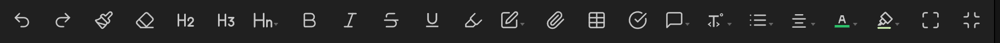
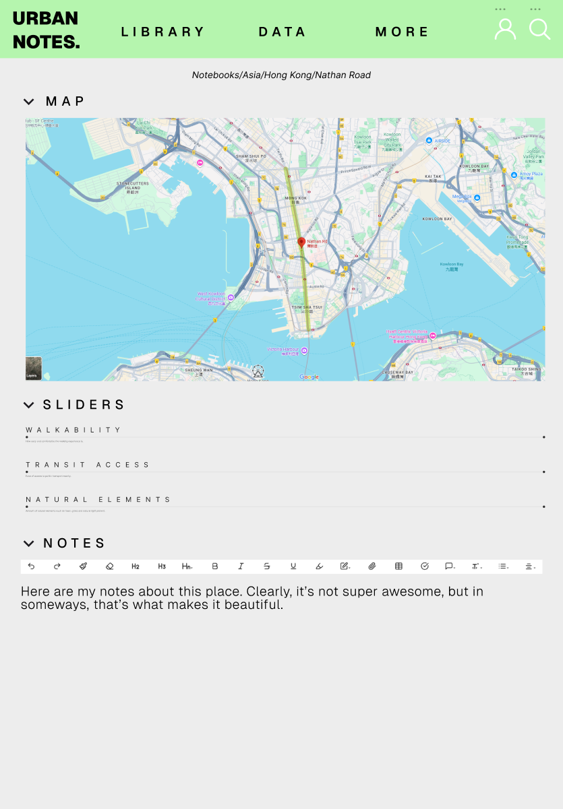
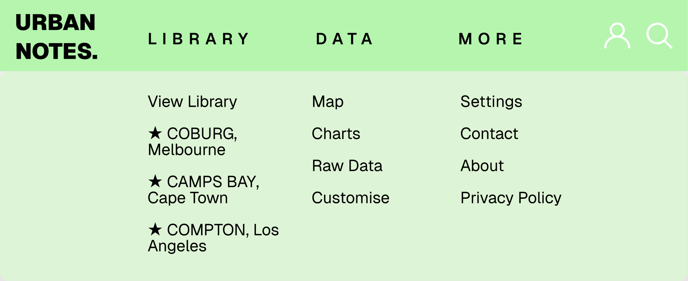

# webapp25
10cpt: assessment task 3 - web application

this project aims to create a functional web application using sqlite, javascript, css and html

## design brief: urban planning notebook
this project aims to create an urban planning notebook web application that allows users to record observations with detail and precision. the app will allow users to easily access and  visualise their notes and data. its an evolution of traditional notetaking apps that's useful for travellers, hobbyists and researchers alike.

| functional requirements | non functional requirements |
| ---- | ------- |
| sync, online and offline capability  | aesthetically pleasing |
| user account management  | scalable backend for future growth | ease of use |
| contact and feedback page | secure user data storage |
| entry management  |
| data visualisation |
| markdown and rich text editing |

#### fonts
the fonts selected are helvetica-style sans fonts, with hard curves. initially, some similar fonts were found on adobe fonts however they were not accessible due to account restrictions.
- [owners text](https://fonts.adobe.com/fonts/owners-text)
- [lorimer no. 2](https://fonts.adobe.com/fonts/lorimer-no-2)
- [acumin](https://fonts.adobe.com/fonts/acumin) 

the chosen font was similar and accessible via [google fonts]( https://fonts.google.com/specimen/Mozilla+Text)

#### colours
the chosen colour scheme is an analogous dark green colour scheme, inspired by natural colours. it also incorporates greys and whites, tying together the colours of the urban environment.

- dark green #3fa053
- light green #b5f5ae
- light blue #b9daff
- dark grey #313633
- white #ffffff

or see [here](https://coolors.co/3fa053-b5f5ae-b9daff-313633-ffffff)

#### theme
the overall themes are inspired by notetaking apps such as notion and obsidian. the landing page is inspired by the canva homepage, while specific elements were also inspired by them such as formatting bar from the *editing toolbar* plugin from obsidian, seen below:

### first design
the wireframes for the first design were completed on paper, see image below.

### second design
the wireframes for the alternative were design created on figma, attached below. this design incorporated similar core elements to the initial wireframes, however included modified layouts and interactions in elements.
see on figma [here](https://www.figma.com/design/hnSb3hvb5pWZTmRY3ifh46/10cpt-assessment-task-3-second-wireframe?node-id=2625-150&t=4e0e1ZbdfMmril36-1) or in the attachments below:

#### data flow
the majority of the user data flow occurs through the header. each of the key headings link to other pages, and the expanded header allows for more detailed user movements. the home page includes a number of links to other pages including types of new notes, recent notes and featured articles.