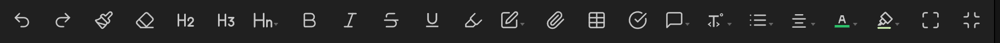
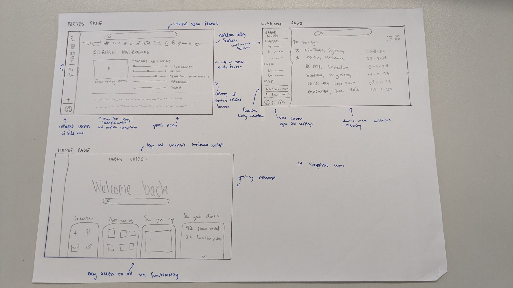
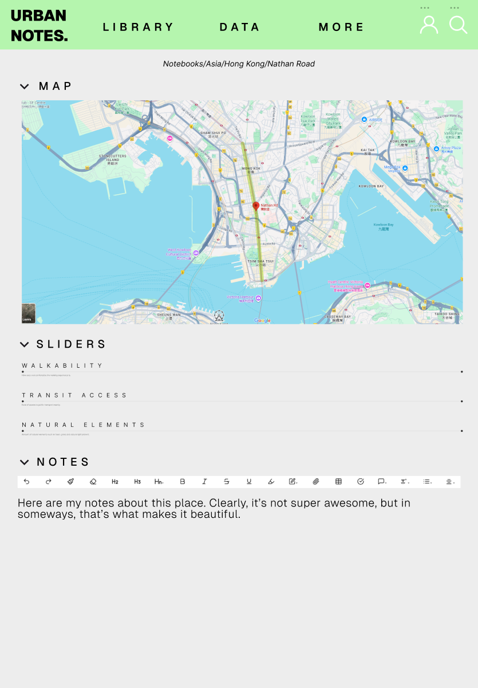
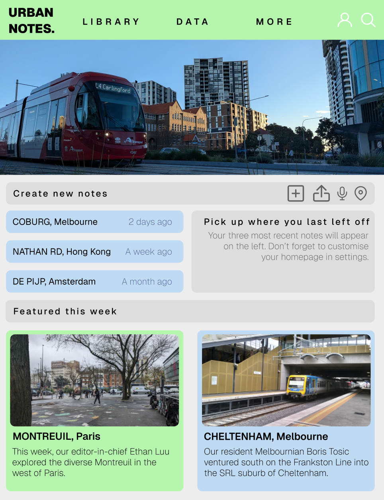
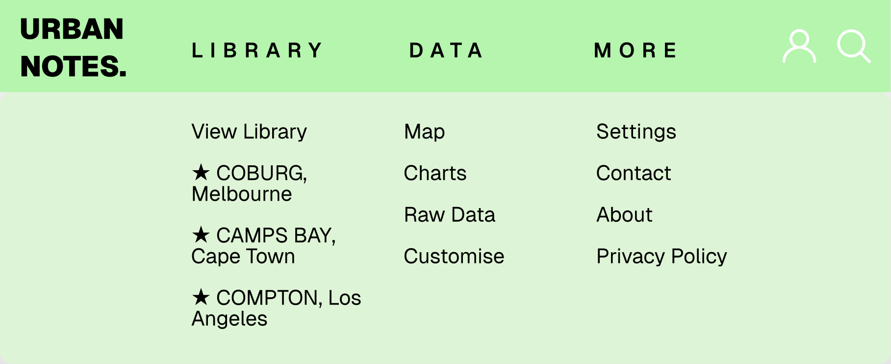
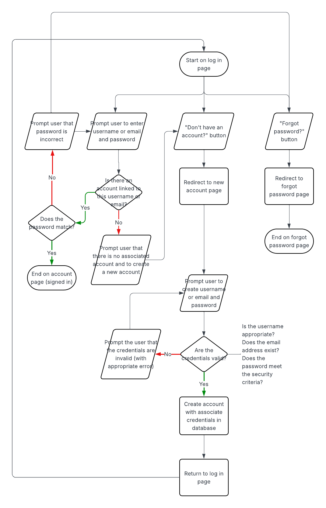

# webapp25
10cpt: assessment task 3 - web application

this project aims to create a functional web application using sqlite3, javascript, python, css and html

## table of contents
- [disclaimer](documentation/DISCLAIMER.md): resources used (including ai)
- [design brief: urban planning notebook](#design-brief-urban-planning-notebook): fonts, colours, themes, designs, dataflow
- [workbook](#workbook): algorithm, test cases, queries, development log, lighthouse reports, task list

## user instructions

## design brief: urban planning notebook
this project aims to create an urban planning notebook web application that allows users to record observations with detail and precision. the app will allow users to easily access and visualise their notes and data. its an evolution of traditional notetaking apps that's useful for travellers, hobbyists and researchers alike.

| functional requirements | non functional requirements |
| ---- | ------- |
| sync, online and offline capability  | aesthetically pleasing |
| user account management  | scalable backend for future growth | ease of use |
| contact and feedback page | secure user data storage |
| entry management  |
| data visualisation |
| markdown and rich text notetaking |
| sharing of posts, articles |

#### fonts
the fonts selected are helvetica-style sans fonts, with hard curves. initially, some similar fonts were found on adobe fonts however they were not accessible due to account restrictions.
- [owners text](https://fonts.adobe.com/fonts/owners-text)
- [lorimer no. 2](https://fonts.adobe.com/fonts/lorimer-no-2)
- [acumin](https://fonts.adobe.com/fonts/acumin) 

the chosen font was similar and accessible via [google fonts](https://fonts.google.com/specimen/Mozilla+Text)

#### colours
the chosen colour scheme is an analogous dark green colour scheme, inspired by natural colours. it also incorporates greys and whites, tying together the colours of the urban environment.

- dark green #3fa053
- light green #b5f5ae
- light blue #b9daff
- dark grey #313633
- white #ffffff

or see [here](https://coolors.co/3fa053-b5f5ae-b9daff-313633-ffffff)

#### theme
the overall themes are inspired by notetaking apps such as notion and obsidian. the landing page is inspired by the canva homepage, while specific elements were also inspired by them such as formatting bar from the *editing toolbar* plugin from obsidian, seen below:

### first design
the wireframes for the first design were completed on paper, see image below.

### second design
the wireframes for the alternative were design created on figma, attached below. this design incorporated similar core elements to the initial wireframes, however included modified layouts and interactions in elements.
see on figma [here](https://www.figma.com/design/hnSb3hvb5pWZTmRY3ifh46/10cpt-assessment-task-3-second-wireframe?node-id=2625-150&t=4e0e1ZbdfMmril36-1) or in the attachments below:

#### data flow
the majority of the user data flow occurs through the header. each of the key headings link to other pages, and the expanded header allows for more detailed user movements. the home page includes a number of links to other pages including types of new notes, recent notes and featured articles.
## workbook
### algorithm
the algorithm was created for the functionality of the log in page. see on lucidchart [here](https://lucid.app/lucidchart/1d9d2cc0-5c7d-4845-8429-0a635598c715/edit?viewport_loc=-78%2C-172%2C2622%2C1310%2C0_0&invitationId=inv_a82f3bc4-e7b0-415b-bcf0-ad197f41dd0a) or in the attachment below: 
### test cases
| test case id | test case name | preconditions | test steps | expected results |
| --- | --- | --- | --- | --- |
| tc-li-1  | successful log in | - user has an account in data base - user knows their credentials | 1. open login page 2. enter valid credentials in provided prompts 3. click 'log in' | user is redirected to account page
| tc-li-2 | failed log in (wrong password) | - user has an account in data base - user knows their email or username but not their password | 1. open login page 2. enter valid username and invalid password in provided prompts 3. click 'log in' | user is prompted that their password is incorrect and login fails
### queries
also stored in [test_cases.sql](database/test_cases.sql)
1. queries all notes that have id *3*, regardless of user --> `SELECT * FROM notes WHERE note_ID LIKE '3';`
2. queries all users created at time of database creation --> `SELECT * FROM userinformation2 WHERE user_created LIKE '2025-08-22 13:30:48';`
3. queries all users with username with a character length of *7* --> `SELECT * FROM userinformation2 db WHERE LENGTH(user_name) = 7;`
4. queries all notes created by users with even numbered ids that contain *UK* in the location --> `SELECT * FROM notes WHERE ( user_ID % 2 ) = 0 AND address LIKE "%UK%";`
5. queries all notes created by users with even numbered username character lengths and that contain *Transit* in the note title --> `SELECT * FROM notes JOIN userinformation2 ON notes.user_id = userinformation2.user_id WHERE ( user_name % 2 ) = 0 AND note_title LIKE "%Transit%";`
### development log
development log started in august 18th in line with course shift away from design towards development.
| date | work completed |
| --- | --- |
| 18/8  | started setting up development environment | 
| 19/8 | finished tempe hs tutorial on setting up development environment |
| 20/8 | started creating own tables in sqlite database |
| 22/8* | finished creating first table in database |
| 23/8* | finished creating second table in database and ran five unique test queries |
| 25/8 | started working through html and css styling tutorial |
| 25/8* | got localhost webpage to work, began styling with html and css |
| 26/8 | attempted to connect database with front end |
| 26/8* | successfully connected database to front end, continued styling and cleared errors |
| 27/8 | unsuccessfully attempted to style page to view data entries in a grid format
| 27/8* | continued styling page, including fixing data entries into grid format and creating floating sidebar using w3schools tutorial |
| 28/8* | added image
| 1/9 | fixed data entries showing with images and fixed width but caused merge error |
| 3/9* | fixed merge issue and adjusted file names

development log discontinued on 3/9 in favour of commit messages and regularly updated to do list

*note: commit times, line changes and messages may not be consistent. during final weeks of development, some commits were delayed and some were staged in multiple rounds to provide more detailed messages*

### lighthouse reports
#### september 18, 2025 (week 9)
- performance: 63-67
- accessibility: 100
- best practices: 97
- seo: 75

low performance rating was linked to long load times of fonts and images. unfinished home page styling also led to slightly reduced best practices and performance marks.
#### october 4, 2025 (week 1, school holidays)
##### home page
- performance: 100
- accessibility: 88 --> 100
- best practices: 100
- seo: 73 --> 100

accessibility and seo ratings were low as some recently images lacked alt text. the page also had no meta description, and the 'more' link in the menu was too generic for the seo rating. revisions to the detected errors saw a significant improvement in marks.
##### log in page
- performance: 78
- accessibility: 92
- best practices: 100
- seo: 100

render blocking requests caused by the imported fonts and icons saw a low performance score. marks were deducted from accessibility due to some buttons with low contrast. revisions were not necessary.

### task list
- [x] fix styling of navigation bar
- [x] learn how to integrate complex queries into python functions for displaying data
- [x] fix display of cards to show in grid format instead of long column
- [x] make table of contents for readme
- [ ] finish styling all pages to sitewide theme
    - [ ] home page
    - [ ] library page
    - [x] map page
    - [ ] about page (+ contact)
    - [ ] note editor
    - [x] log in page
    - [x] account settings page
    - [x] articles page
    - [ ] search bar landing
- [x] account features
    - [x] correct html input
    - [x] integrate log in features into rest of website
    - [x] dynamic account settings text in menu
    - [x] style create account page
    - [x] account page functionality
- [x] note taking feature functionality
    - [x] inputting and saving notes
    - [x] viewing and accessing notes in library feature
    - [x] inserting images
- [x] articles feature functionality
    - [x] link to view articles
    - [x] generate articles and import to database
    - [x] show username of article author in browsing page
- [x] profile page
    - [x] access to user settings
    - [x] profile picture and bio
    - [x] shows your posts
- [x] search bar feature
    - [x] landing page with redirects
    - [x] functional bar
- [x] sidebar
    - [x] new note button location
    - [x] collapsibility
    - [x] account button functionally showing at bottom of menu

### deferred tasks
*these tasks would see improvements to the website, however they are not within the current scope and timeline of the project*

- [ ] delete account feature
- [ ] offline functionality
- [ ] continue investigating containers, vm and other ways of running the web page
- [ ] profile page statistics/history section (likes, reposts, views, completions of other articles)
- [ ] pins showing for locations of notes on map
- [ ] posting articles from notes
- [ ] sharing individual notes via url